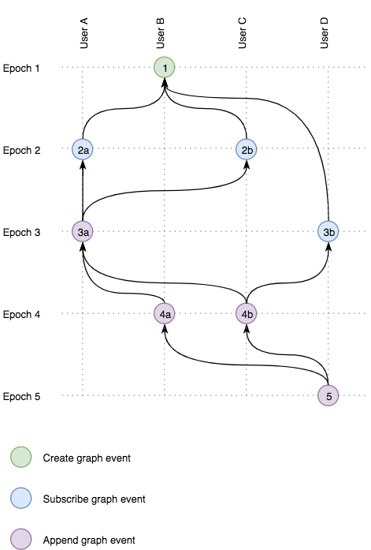

# Nimona Graphs

### TL;DR

Graph based "data type" for peer to peer / decentralized applications with
permissions that allow peers to subscribe for updates.

### Warning

Let's get some things out of the way; the name kinda sucks and various kinks
have not been yet ironed out. If you have any suggestions, questions, concerns,
or ideas; please drop by the issues and let's have a chat.

### Purpose

To create a data structure that can live in a peer to peer or decentralized 
network and have the following list of features:

* Easy to sync missing and new updates.
* Allow for updates, optionally with an inherit way to resolve conflicts.
* Allow peers to subscribe to future updates.
* Allow for permissions, at the very least read, write, and subscribe.

### Specification

#### Terminology

* `GRAPH` - An instance of our graph-based datatype. Basically a graph of events.
* `EVENT` - An update on an existing graph. Check out the "Graph event types".
* `PAYLOAD` - An arbitrary binary payload. Application specific.
* `PARENTS` - Each event is linked to at least one previous events; these are its `PARENTS`.
* `TIP` - One or more events at a given moment that are not in any other event's `PARENTS`.
  These are also the most recent events.
* `PEER` A network peer with a keypair that has access to a graph.

#### Graph event types

Graph events persist in the graph.  
Events are identified by their hash. After the first event of each graph, all
other events are linked to one or more parent events, forming the graph.

All events in our graph will be one of these types.

* `CREATE` - Creates a new graph. This event type is the only one without parents.
* `SUBSCRIBE` - Subscribes a peer to a graph.
* `APPEND` - Adds an event to the graph. Append events are the only ones that
  can contain application data (payload).

#### Network event types

Network events are events that help peers create, update, or sync graphs between
themselves. They do not persist in the graph itself.

* `ANNOUNCE(EVENT)` - Announces an event to a peer.
* `SYNC(TIP)` - Tries to synchronize missing events with a peer by exchanging
  tips. Both peers will work backwards from the tips they received, figure out
  the events they are missing and retrieve them.
* `GET(EVENT_ID)` - Request an event by its id.

#### Chatroom example

This is an example of this data type being used in a chat room application.

Each chat room is a graph and messages are events on that graph.

*Note: Epochs are just for demonstration purposes, they just show events that 
happened and were propagated in the network at the same time.*



##### Epoch 1

User B wants to create a new chat room, and allow users A, C, and D to be able
to send messages to it.

So `EVENT 1` is a `CREATE` event that would look something like:

```
{
    id: "1", // hash of the header
    header: {
        data_hash: "760c0f69", // hash of the event data
        signature: "..." // signature of the event data
    },
    data: {
        type: "nimona.io/graphs/create",
        owner: "user-b", // user b's fingerprint
        created: "2017-07-22T18:00:00Z",
        permissions: {
            user-a: ["WRITE"], // Write assumes READ and SUBSCRIBE
            user-c: ["WRITE"],
            user-d: ["WRITE"]
        }
    },
    metadata: {}
}
```

User B gives `WRITE` permissions to users A, C, and D, signs the event, and
`ANNOUNCE`s it to users A, C, and D.

##### Epoch 2

Users A and C decide that they care about this and both decide to subscribe to
it by creating `SUBSCRIBE` events.

Right now both users know of only one event in this graph (the `CREATED` one).
So the `TIP` of the graph is just `EVENT 1`. Both the `SUBSCRIBE` events will 
have `EVENT 1` as their `PARENTS`.

Both Users will now `ANNOUNCE` their new events (`EVENT 2a` and `EVENT 2b`) to 
all users that have subscribed to the graph so far (which is none yet), to all
users that have at least `READ` access to the graph, and to the creator of the
graph.

*Note: Where all events will be `ANNOUNCED` to all users with access or only
the `SUBSCRIBE` events, is still under consideration.  
We can probably consider all peers with access already subscribed and reserve
the `SUBSCRIBE` event for peers that do not have direct `READ` access.  
eg. When a graph has public/anonymous READ access.*

This means that event `2a` will be `ANNOUNCED` to users b, c, and d.  
And event `2b` will be `ANNOUNCED` to users a, b, and d.

For example `EVENT 2a` will look something like this:

```
{
    id: "2a",
    header: {
        data_hash: "69f73e4e",
        signature: "..."
    },
    data: {
        type: "nimona.io/graphs/subscribe",
        owner: "user-a",
        created: "2017-07-22T18:00:30Z",
        parents: [
            "1" // EVENT 1's id
        ]
    },
    metadata: {}
}
```

##### Epoch 3

User A is the first to send a message to this new chat room.  

Since in Epoch 2, both User A and C created their events at the same time, our
current graph `TIP` consists of `EVENT 2a` and `EVENT 2b`. These will be the
`PARENTS` of the new event.  

This event will look something like:

```
{
    id: "3a",
    header: {
        data_hash: "4ba88fcb",
        signature: "..."
    },
    data: {
        type: "nimona.io/graphs/append",
        owner: "user-a",
        created: "2017-07-22T18:01:00Z",
        payload: { // payload is application specific and up to the developer
            message: "Hello room!"
        },
        parents: [
            "2a",
            "2b"
        ]
    },
    metadata: {}
}
```

User will `ANNOUNCE` this event to all users with `READ` access.

At this point, User D also subscribes to the graph but let's say they still only
knows of the first event (`EVENT 1`) because they were offline and did not get
events `2a` and `2b`. This will result in a `SUBSCRIBE` event (`EVENT 3b`) which
will be announced to all users because of their `READ` access, owner, etc.

##### Epoch 4

Let's mess things up a bit now.

User B is sending a message but has only received event 3a and not 3b.  
This means that event 4a's parents will only be event 3a.

User C is also sending a message but they have received both events 3a and 3b.  
This means that event 4b's parents will have both events 3a and 3b.

When user C sends their event `4b` to user B, user B will notice that this new
event has a parent that it was not aware of (`3b`), so it will attempt to sync
with the other peers (starting with user B) to find the missing events.

Since all events are being sent to all subscribed peers, even if a peer was 
offline and lost events, they can retrace the events through their parents and
catch up with the rest of the network.

*Note: Peers can basically sync whenever they feel like, so we might need to set
some more strict rules on when they should and should not be syncing.*

## Literature

* [Gun - A realtime, decentralized, offline-first, graph database engine.](https://github.com/amark/gun)
* [Orbit - Distributed peer-to-peer database on IPFS](https://github.com/orbitdb/orbit-db)
* [The SWIRLDS Hashgraph Concensus Algorithm](http://www.swirlds.com/downloads/SWIRLDS-TR-2016-01.pdf)